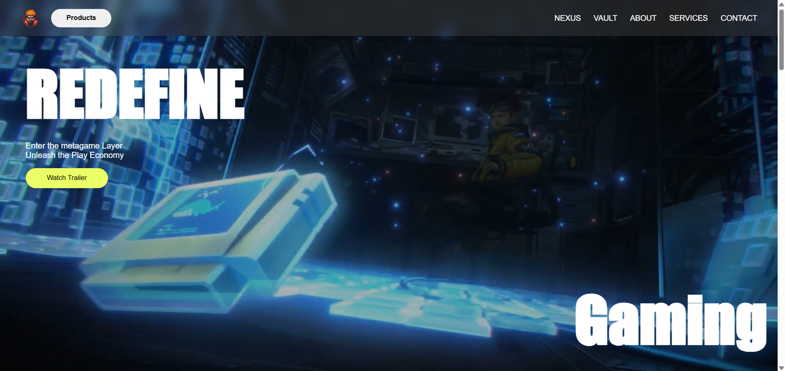
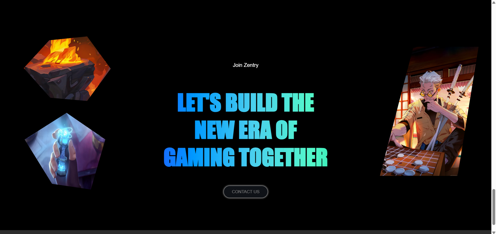

# 🎮 Zentry  
**Zentry** is a visually striking, single-page **promotional website** for a conceptual gaming platform.  
It features a **modern, dark-themed interface** with **dynamic video backgrounds**, **scroll-triggered animations**, and a **responsive layout**.  
The site introduces the **Zentry ecosystem**, which aims to **unify digital and physical gaming experiences** into a single **“Play Economy.”**  

## 🚀 Live Demo  

🔗 [View Live Project Here](https://zentry-nexus.netlify.app/) 

## 📸 Screenshots  

### 🔹 Hero Section  
  

### 🔹 Discover Section 
  

### 🔹 Join Zentry Section 
  

## ✨ Features  

- 🎥 **Dynamic Hero Section** – A full-screen video background cycling through multiple clips, with an interactive **NEXT** button.  
- 🌀 **Modern CSS Animations** – Uses `animation-timeline: view()` for engaging scroll effects (blur-in, scaling, etc.).  
- 🌈 **Animated Gradient Text** – Eye-catching linear gradient animations on key headings.  
- 📱 **Responsive Design** – Smoothly adapts to desktop, tablet, and mobile screens.  
- 🗂 **Informative Card Layout** – CSS Grid cards showcase **Radiant, Zigma, Nexus, and Azul**.  
- 🖱️ **Interactive Elements** – Hover effects on cards, buttons, and a central button to cycle hero videos.  
- 🎨 **Icon Integration** – Custom icons used for better visual storytelling.  


## 🛠️ Technologies Used  

- **HTML5** – semantic and structured layout  
- **CSS3** – Flexbox, CSS Grid, custom properties, scroll-driven animations  
- **JavaScript (Vanilla JS)** – video cycling, interactive elements, and footer year update  


## 🚀 Getting Started  

To run this project locally:  

1. Clone the repository:  
   ```sh
   git clone https://github.com/diwaker-kanojia/zentry.git

## 📂 Project Structure
```sh
├── index.html        # Main HTML file (site structure)
├── style.css         # Styling and animations
├── script.js         # JavaScript for interactivity
├── images/           # Image assets (.webp, .png)
└── videos/           # Video assets (.mp4)
